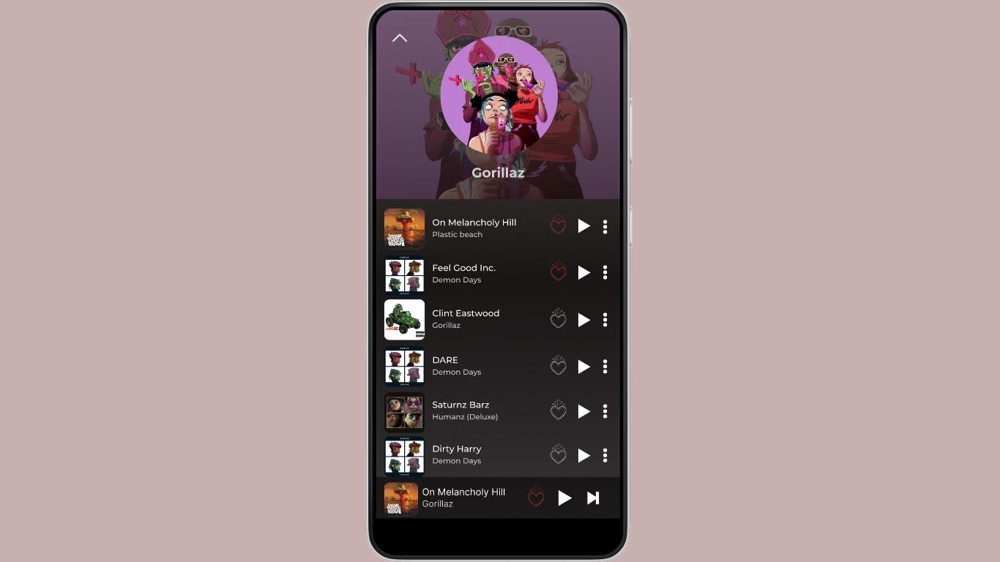

#Vader Music 

>  O QUE VOCÊ OUVE, NA VERDADE É O QUE VOCÊ É.
  

Esse projeto foi uma atividade proposta pelo meu professor Gabriel Augusto, do instituto PROA. 

Eu sou apaixonado por música e pelo poder que ela carrega em si, e nada melhor do que aprender desenvolvendo um projeto sobre meu gosto musical. Curti bastante desenvolver esse projeto e logo mais continuarei postando meu desenvolvimento. :)

> DESENVOLVIMENTO

Por gostar bastante de Star Wars, logo pensei em fazer um app de música com base no Darth Vader. 

O Desenvolvimento do projeto durou em torno de 4 dias e consegui aprender bastante as funcionalidades do Figma. Esse é apenas o meu primeiro projeto no Figma e meu aprendizado não para por ai. 

## 💻 Tecnologias

- FIGMA 

> MÚSICAS ESCOLHIDAS:

- Stan - Eminem, Dido.
- On melancholy hill - Gorillaz
- Detroit Rock City - Kiss
- Dreams - Fleetwood Mac

## Link para o projeto no Figma: 
[Clique aqui](https://www.figma.com/file/JuinjMF5EU2IfluGBh0tR6/Vader-Music-APP?node-id=0%3A1)

## 💙 Contato

lucascfranca11@gmail.com